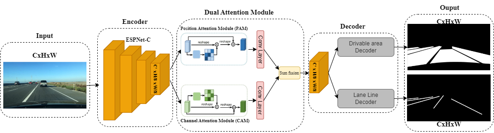
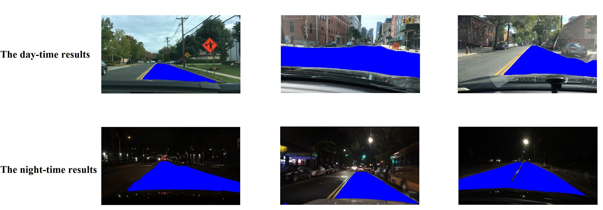
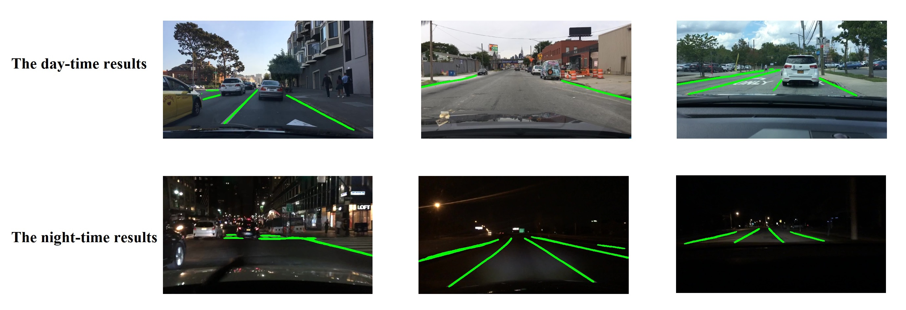

# TwinLiteNet: Efficient and Lightweight Model for Drivable Area & Lane Segmentation

## 🔥NEW🔥 **🔴 TwinLiteNetPlus 🔴** has been officially released!

Check it out now at [](https://arxiv.org/abs/2403.16958) [](https://github.com/chequanghuy/TwinLiteNetPlus) for enhanced performance and new features! 🎉🔥

TwinLiteNet is a lightweight and efficient deep learning model designed for **Drivable Area Segmentation** and **Lane Detection** in self-driving cars. This repository provides the code and resources needed to train, evaluate, and deploy TwinLiteNet.

---

## 🚀 Requirements

Make sure you have the required dependencies installed:
```bash
pip install -r requirements.txt
```

---

## 📂 Data Preparation

1. **Download images** from [BDD100K Dataset](https://bdd-data.berkeley.edu/).
2. **Download annotations**:
   - Drivable Area Segmentation: [Google Drive](https://drive.google.com/file/d/1xy_DhUZRHR8yrZG3OwTQAHhYTnXn7URv/view?usp=sharing)
   - Lane Line Segmentation: [Google Drive](https://drive.google.com/file/d/1lDNTPIQj_YLNZVkksKM25CvCHuquJ8AP/view?usp=sharing)

### **Dataset Structure**
```bash
/data
    bdd100k
        images
            train/
            val/
            test/
        segments
            train/
            val/
        lane
            train/
            val/
```

---

## 🏗️ Pipeline Overview

<div align="center">
    
</div>

---

## 🔥 Training
Train the model using the command:
```bash
python3 train.py
```

---

## 🎯 Testing
Evaluate the model performance using:
```bash
python3 val.py
```

---

## 🖼️ Inference
Perform inference on images:
```bash
python3 test_image.py
```

---

## 🔍 Visualization
### **Drivable Area Segmentation**
<div align="center">
    
</div>

### **Lane Detection**
<div align="center">
    
</div>

---

## 📜 Acknowledgment
This work is inspired by:
- [ESPNet](https://github.com/sacmehta/ESPNet)
- [YOLOP](https://github.com/hustvl/YOLOP)

---

## 📖 Citation
If you find our work helpful, please consider **starring** ⭐ this repository and citing our paper:

```BibTeX
@INPROCEEDINGS{10288646,
  author={Che, Quang-Huy and Nguyen, Dinh-Phuc and Pham, Minh-Quan and Lam, Duc-Khai},
  booktitle={2023 International Conference on Multimedia Analysis and Pattern Recognition (MAPR)}, 
  title={TwinLiteNet: An Efficient and Lightweight Model for Driveable Area and Lane Segmentation in Self-Driving Cars}, 
  year={2023},
  pages={1-6},
  doi={10.1109/MAPR59823.2023.10288646}
}
```
